# GoogleCloud(谷歌云)配置教程

---

## 1. 准备工作

> 1. 谷歌云账号 [GoogleCloud](https://cloud.google.com)
> 2. Xshell 客户端 [Xshell](https://www.xshell.com)

---

## 2. 创建 ComputeEngine 实例

> 1. 进入[谷歌云控制台](https://console.cloud.google.com)并选择创建 **ComputeEngine** 实例
>    > 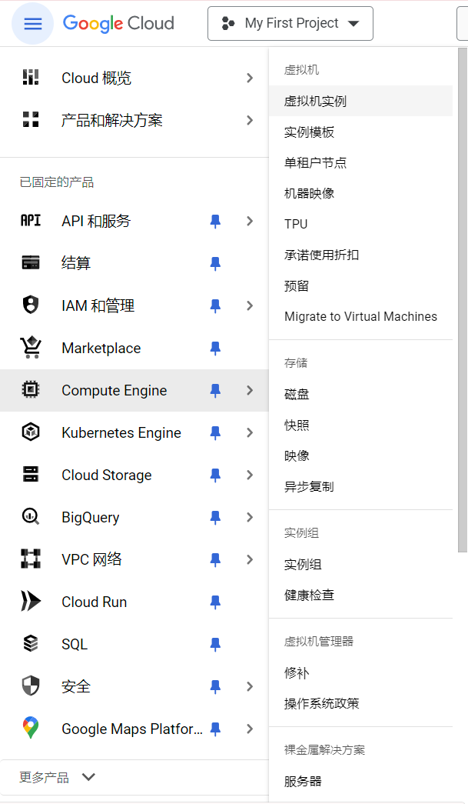
> 2. 点击 **创建实例**
>    > 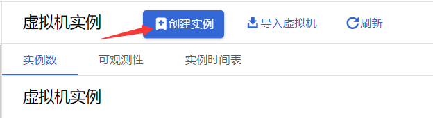
> 3. 名称，区域，可用区 **按需选择**
>    > 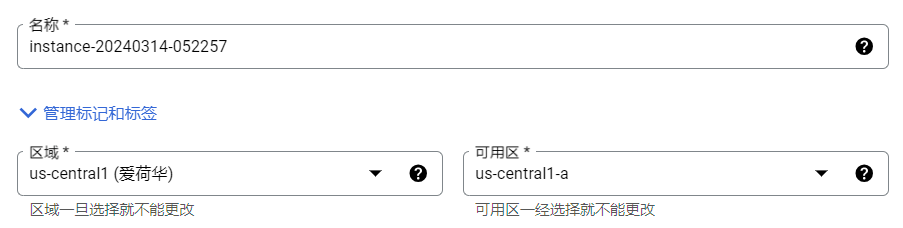
> 4. 机器类型选择 **e2-micro** （最便宜的）
>    > 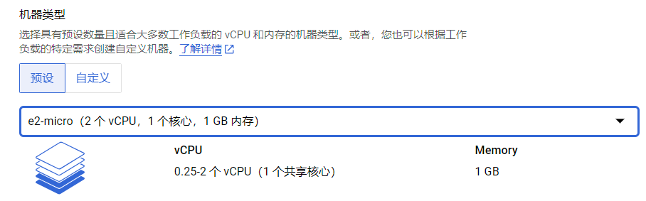
> 5. 可用性政策选择 **标准**
>    > 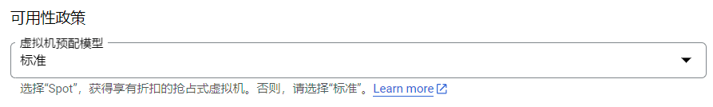
> 6. 防火墙选择 **允许 HTTP/HTTPS 流量**
>    > 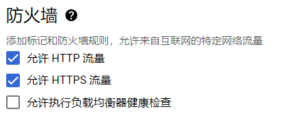
> 7. 其余保持默认 点击 **创建**

---

## 3. 配置防火墙规则

> 1. 点击 **VPC 网络** 中的 **防火墙**
>    > 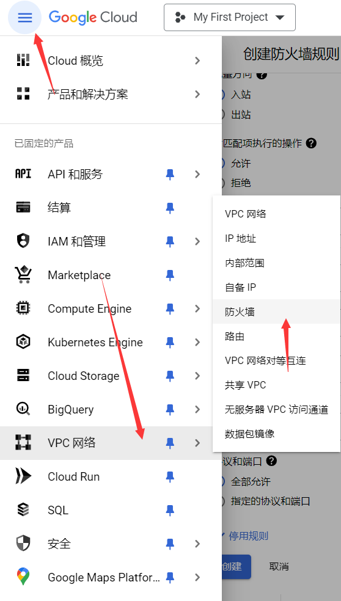
> 2. 点击 **创建防火墙规则**
>    > 
> 3. 名称 **任意**
>    > 
> 4. **其余设置** 如下
>    > 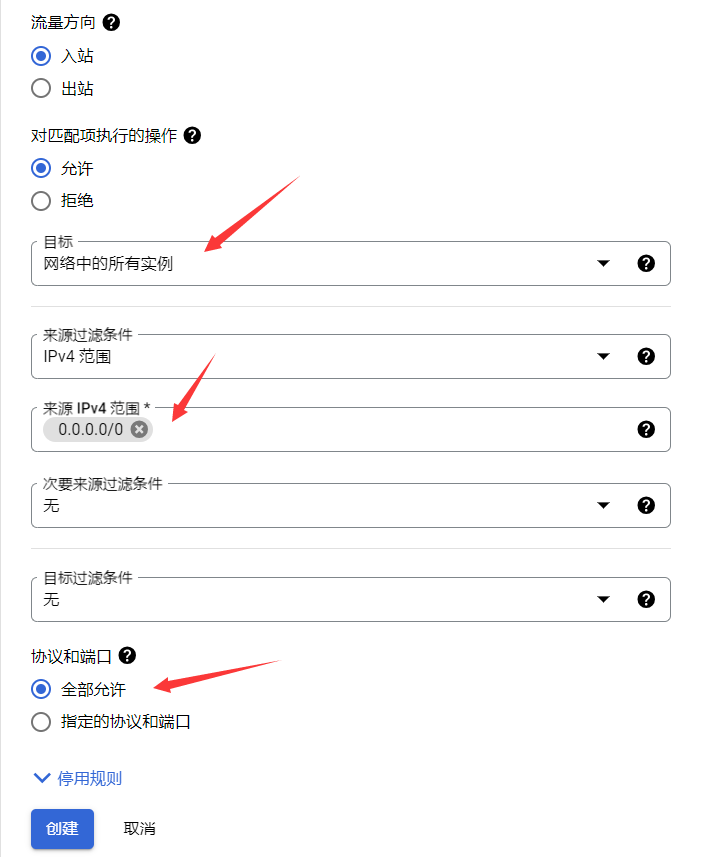
> 5. 点击 **创建**

---

## 4. 为谷歌云实例分配静态 IP 地址

> 1. 点击 **VPC 网络** 中的 **IP 地址**
>> 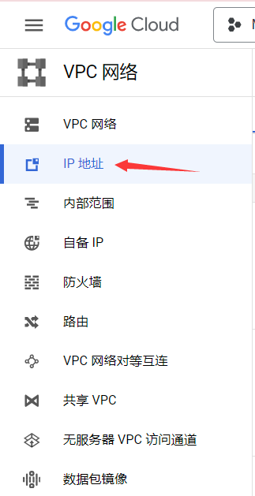
> 2. 点击 **预留外部静态 IP 地址**
>> 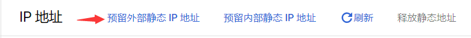
> 3. 名称 **任意** ，地区选择与刚刚创建的实例 **相同**，附加目标选择刚刚创建的实例
>> 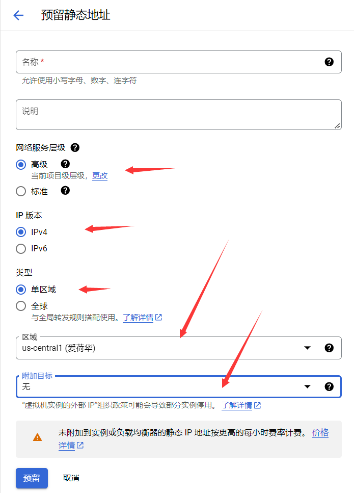
> 4. 点击 **预留**

---

## 5. 使用 Xshell 创建 RSA 密钥并在谷歌云实例中添加认证

> 1. 打开Xshell客户端
> 2. 点击 **工具** -> **用户密钥管理者**
>> 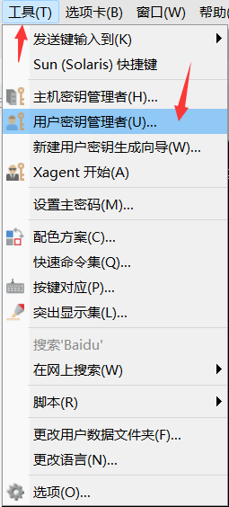
> 3. 点击 **生成**
>> 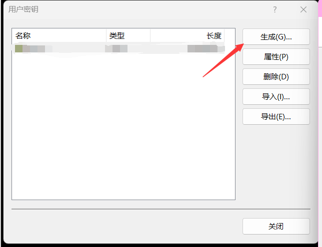

---

## 6. 连接到谷歌云实例

---
